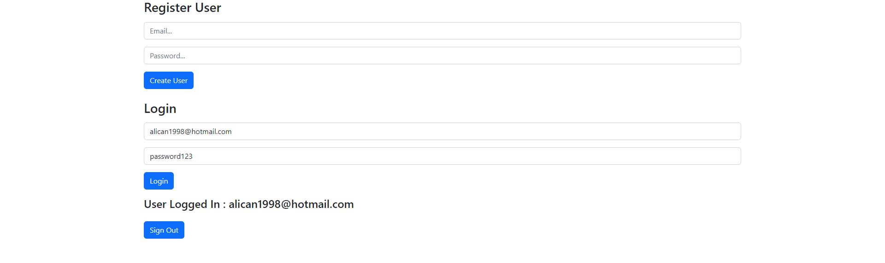

# → React + Firebase ile Giriş/Kayıt Paneli Uygulaması ←

> ### Proje Link 📎 → 

<br>

>↓ Uygulama İçi Görsel ↓ 🖼



<br>

>↓ Kullanılan Araçlar ↓ 🛠

* HTML
* REACT.js
* Google Firebase
* Bootstrap

<br>

>↓ Kurulum ↓ 🧱

```
npm install
npm start
```

<br>

> → İletişim →  📩 :
> alicanbayazit300@gmail.com